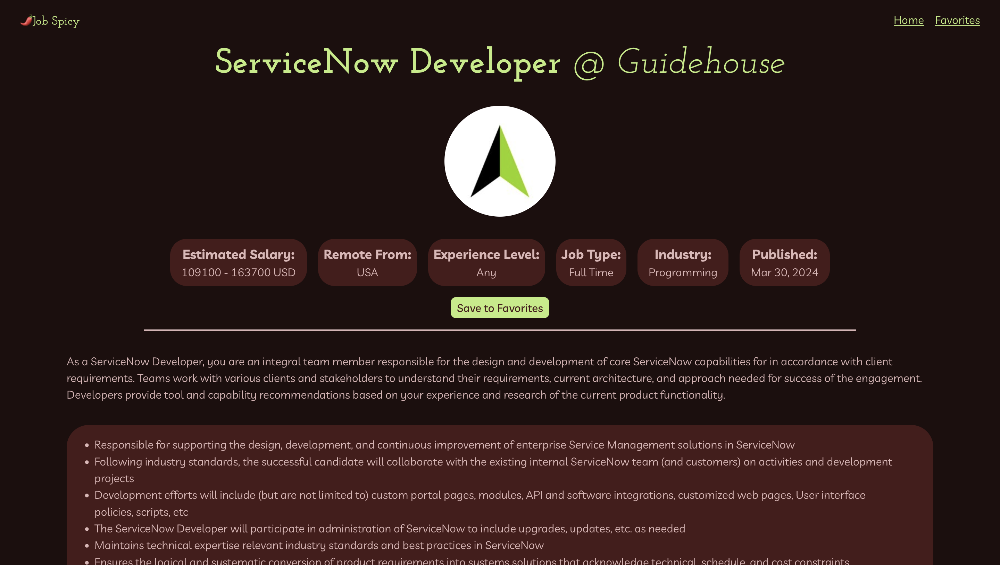
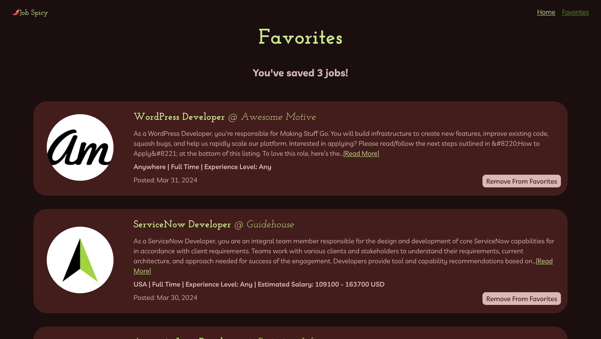

# JobSpicy 

Created by [Nicole Blanchette](https://github.com/nicoleblanchette)

## 🚀 Mission statement

Our application, 🌶️JobSpicy, is for people looking for remote work anywhere in the world. Jobs can be narrowed down by keyword, industry, and location for a more personalized experience.

## Preview

## API

This application uses the JobIcy API. The API documentation and endpoints used in the project can be found below.

- [JobIcy API Documentation](https://jobicy.com/jobs-rss-feed)
- Endpoint #1 | https://jobicy.com/api/v2/remote-jobs
  - Generic list of remote jobs
- Edpoint #2 | https://jobicy.com/api/v2/remote-jobs?count=${COUNT}&geo=${LOCATION}&industry=${INDUSTRY}&tag=${TAG} 
  - Filtered jobs by count, region, industry, and user input

## User Stories

**The core features of the application include:**

* Users can view a list of real remote job openings around the world
* Users can fill out a form to filter jobs by keyword, industry, count, and location
* Users can click on a job for more details 

**Additional features include:**

* Users can save jobs to a favorites list
* Users can remove jobs from their favorites list
* Users can navigate between a home and favorites tab
* Users can see a count of how many jobs they have favorited
* Users can see additional information about each job like an extended description, salary range + currency, job type, and publishing date.
